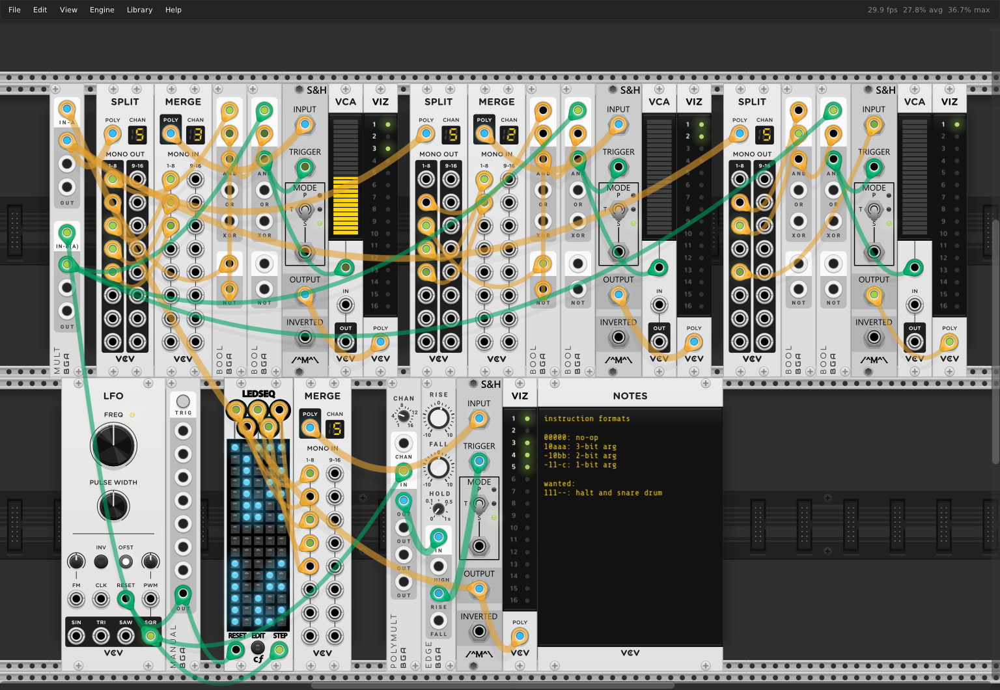
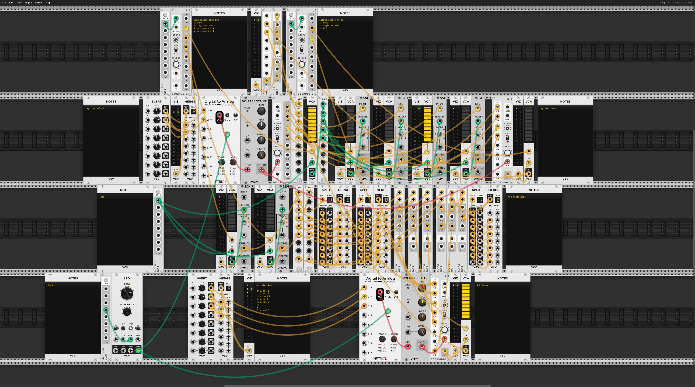
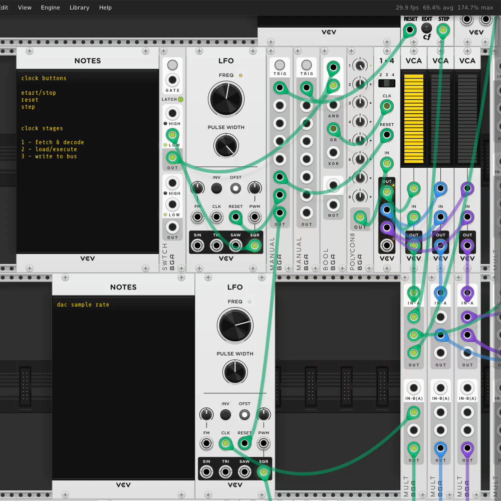
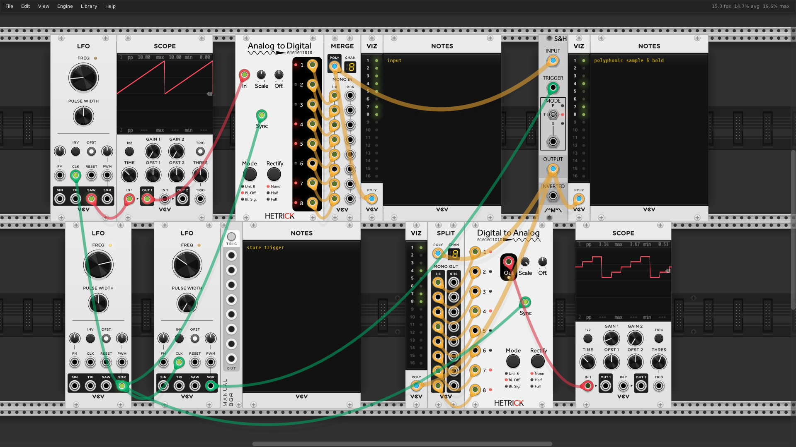
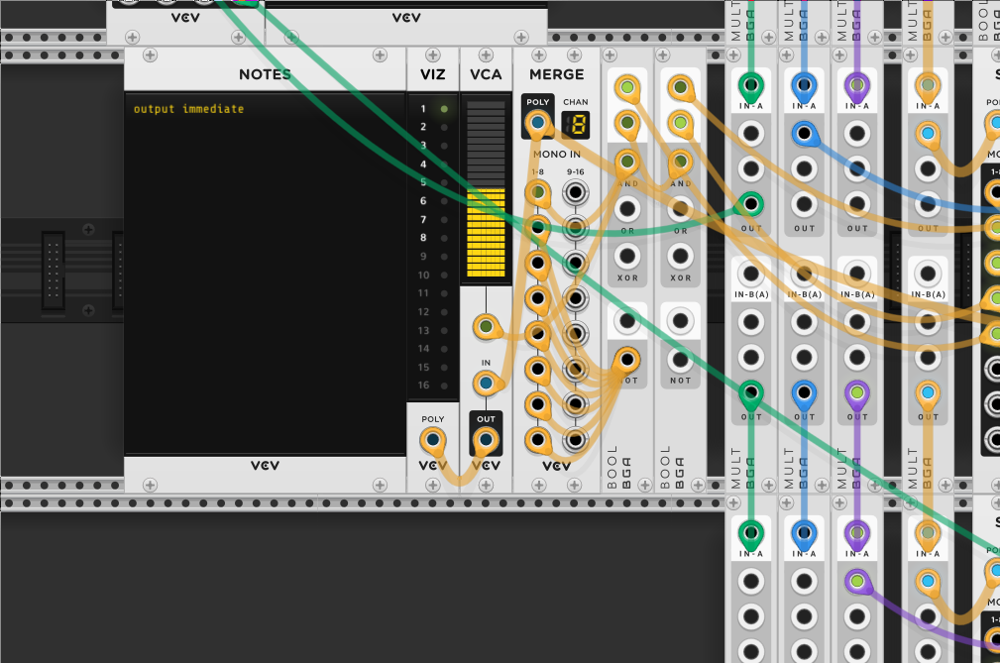
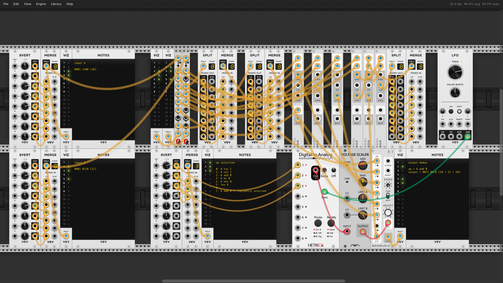
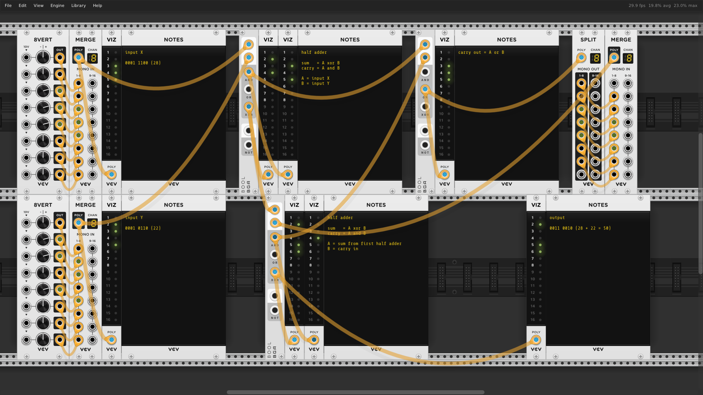
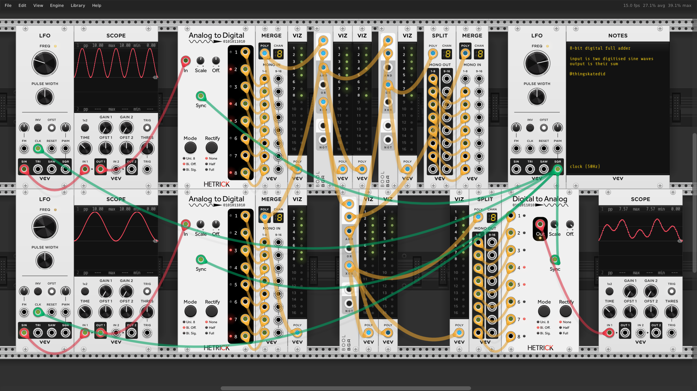

## A CPU implemented in an analog modular synthesizer

This runs in the [VCV Rack](https://vcvrack.com/) eurorack simulator.

I wrote a thread explaining the CPU [on twitter](https://twitter.com/thingskatedid/status/1476679065411022849)  
and a thread [explaining just the ripple adder](https://twitter.com/thingskatedid/status/1475128017374437380).

TODO list: https://github.com/katef/eurorack-cpu/issues/1


[Here's the unannotated screenshot](img/cpu.png)
and [here's a video of the whole thing running](img/cpu-running.mp4?raw=true)

Instruction formats:

```
00000: no-op (clears bus)
10ooo: output ALU op to bus
010rr: load reg from bus (keeps bus)
110rr: output register to bus
0110n: load ALU operand (clears bus)
0111i: output immediate to bus

ooo = alu op
rr = register number
n = alu operand
i = immediate
```

## Fetch and Decode

[and a video of it running](img/instruction-decoding-running.mp4?raw=true)

## Data bus


## 3-Stage Clock


## A single register


## Register bank


## Immediate value


## ALU


## Ripple carry adder



