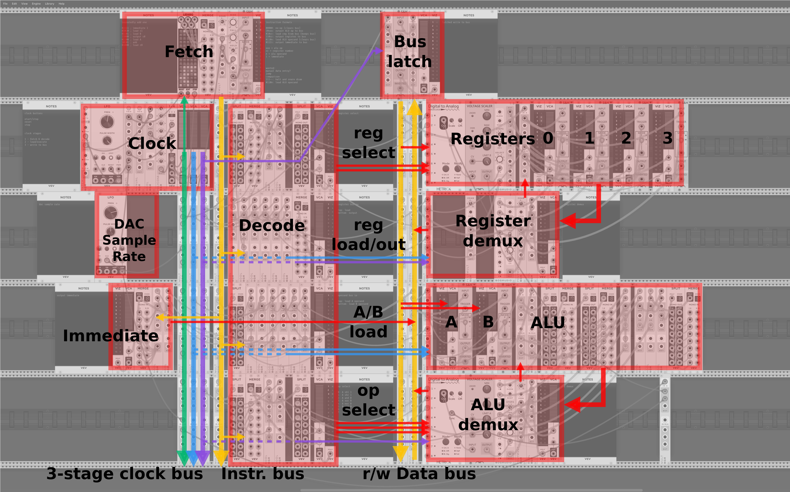

A CPU implemented in an analog modular synthesizer

This runs in the [VCV Rack](https://vcvrack.com/) eurorack simulator.



[Here's the unannotated screenshot](img/cpu.png)

Instruction formats:

```
00000: no-op (clears bus)
10ooo: output ALU op to bus
010rr: load reg from bus (keeps bus)
110rr: output register to bus
0110n: load ALU operand (clears bus)
0111i: output immediate to bus

ooo = alu op
rr = register number
n = alu operand
i = immediate
```

